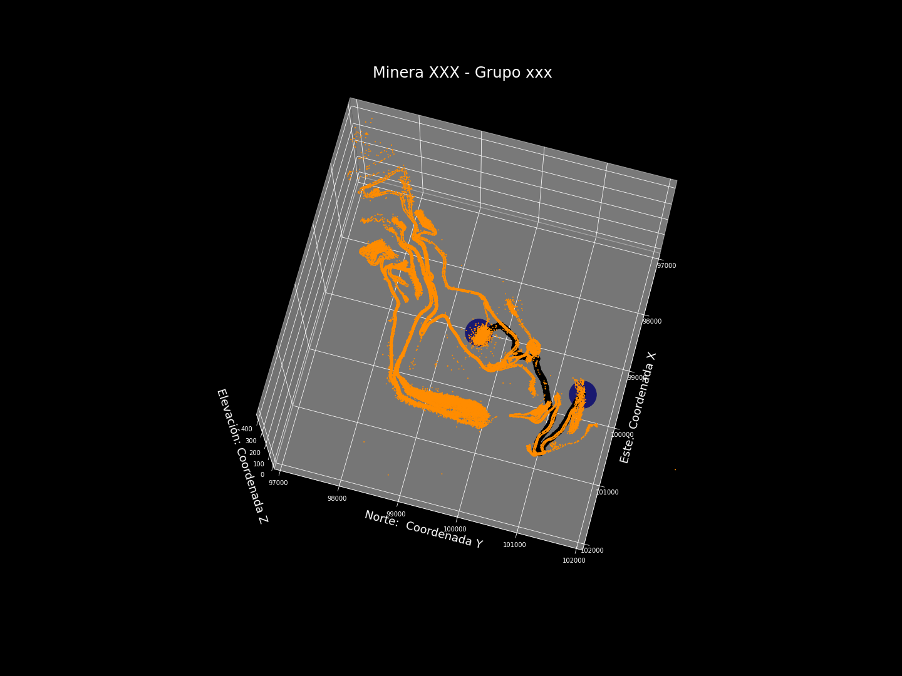
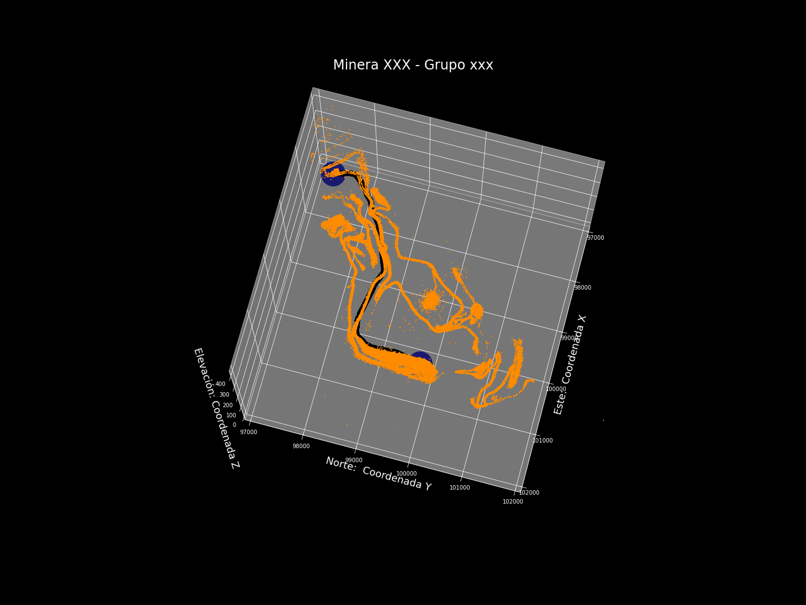
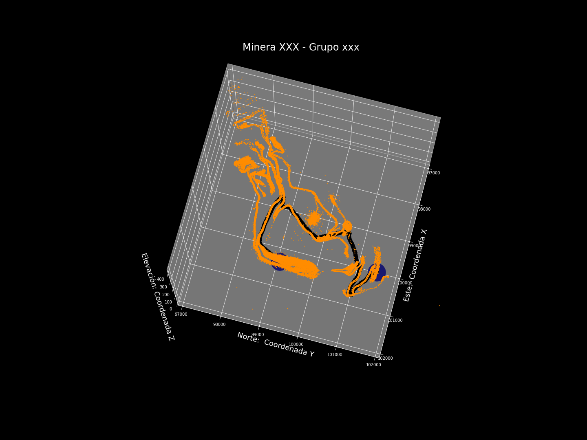
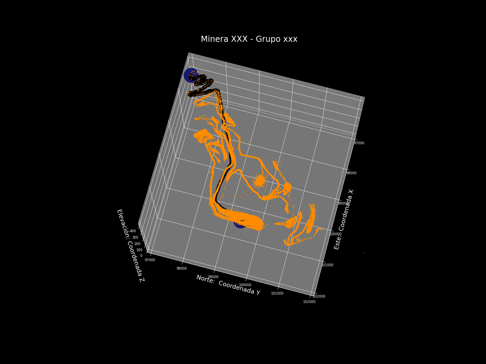
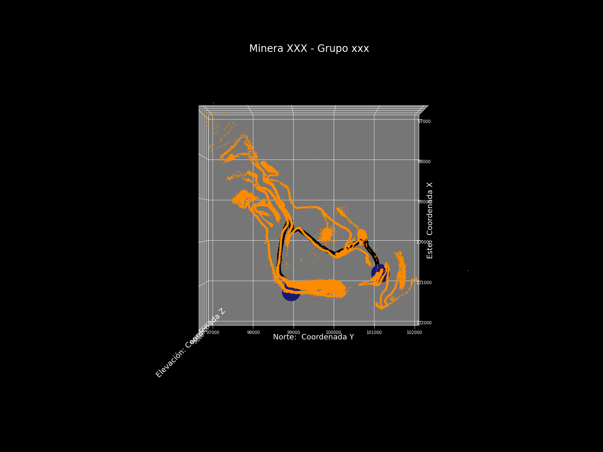
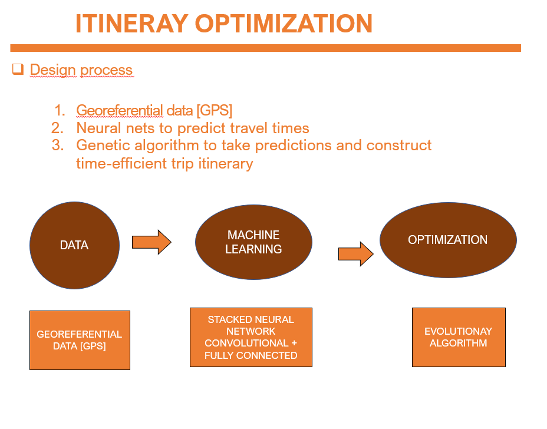
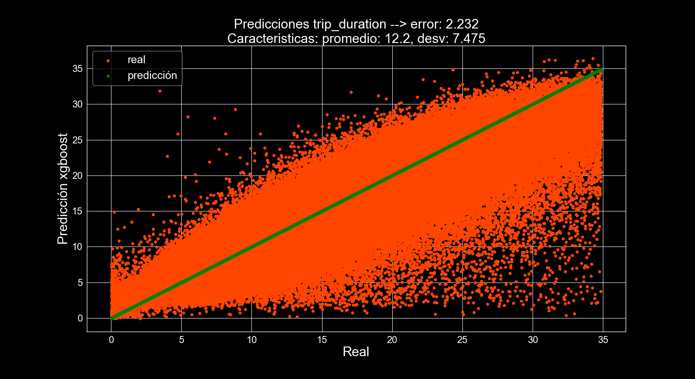
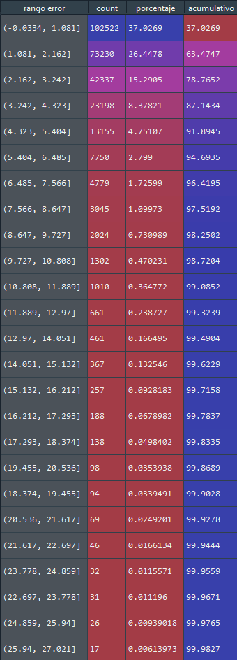

# Routes optimization
Esta en desarrollo, este repo, quedan partes por implementar ...

Dado que el algoritmo genetico, se demora mucho en poder enconrtar la conexión de rutas correcta, es mejor pensar este desarrollo como si fuese ser instalado en un servidor, por lo tanto, el código es pensado de esta manera.


## Introducción

La idea de este repositorio, es poder resolver problemas de optimización de rutas en vehiculos pertenecientes a la cadena de supply, es decir dado un conjunto de puntos por los cuales es necesario pasar, cual es la ruta óptima con tal de minimizar el tiempo en ruta de la flota, optimizar las planificaciones ¿que equipo debe suplir que demanda en particular?, ¿como lo hace recorriendo la menor distancia posible?.


En el repo se tratará de resolver a las siguientes preguntas:

* **Optimización de reparto dentro de la flota: [optimización lineal]**


Esto responde a la pregunta, dado una cierta demanda a abastecer, que en el caso de la minería viene dado por las toneladas transportadas, la ley del cobre y el tamaño de la flota, ¿que porcetaje la meta productiva, objetivo, demanda a abastecer?, debe encargarse el equipo_i  de la flota?, esto se hace planteando un problema de optimización lineal el cual será hablado en la sección correspondiente del README.md


* **Optimización de la distancia viajada desde un punto a otro: [optimización lineal dijkstra]**


Esto responder a la pregunta, dado un conjunto finito de puntos, en los cuales me puedo mover, de que manera debo hacerlo para que el camino recorrido, tenga la menor distancia para ir de un punto a otro, este algoritmo también puede ser aplicado si es que se posee el tiempo en desplazarse desde un punto a otro. 


* **Optimización de un itinerario: [redes neuronales + algoritmos geneticos]**


Dado un conjunto de puntos por los que debo pasar, como debe ser mis movimientos de manera de hacerlo minimizando el tiempo de flota, la idea de esta última en el repo es poder empezar a combinar todas las demás optimización para poder llegar a una completa optimización de la cadena de abastecimiento.


* **Combinación de las soluciones:**

Una vez resueltos estos 3 problemas, se puede decir que en terminos de supply chain dada la información georeferencial, podemos resolver la mayor parte de problematicas.


## Optimización de la distribución dentro de la flota:


Este problema no es muy escalable, dado que cada empresa tendra distintas restricciones en el planteamiento de un posible solución, por lo que es más para guiarse en los problemas de optimización, realizado PPL y tener un manejo de las distintas librerías que ofrecen solver para este tipo de problemas.


Planteamos el siguiente problema de optimización para determinar cuantos ciclos se debe realizar en que punto de abastecimiento para cumplir la meta productviva:

<p align="center">
  
</p>

<p align="center">
  
</p>

<p align="center">
  
</p>

<p align="center">
  
</p>


Con esto podemos llegar a la cantidad exacta de ciclos dado una meta productiva del día.


## Optimización de tomar la ruta más corta en un circuito cerrado de puntos

Dado un mapa de puntos, cual es el camino más corto en distancia, para ello se ocupa un conjunto de caminos

* https://es.wikipedia.org/wiki/Algoritmo_de_Dijkstra

Esto lo hice después de realizar el modelo de machine learning para determinar el tiempo de viaje, pero es una buena alternativa para mezclarlo con los algoritmos geneticos.

<p align="center">
  
</p>


<p align="center">
  
</p>


<p align="center">
  
</p>


<p align="center">
  
</p>

<p align="center">
  
</p>

<p align="center">
  
</p>


## Optimización de un itinerario
Dado un conjunto de puntos por los cuales debemos repartir X demanda, o material a extraer desde un cierto punto la manera de realizarlo, para quie esto conlleve a una minimización del tiempo activo de la flota.


Lo que se estará desarrollando será la siguiente idea:


<p align="center">
  
</p>


Esto contiene dos etapas, uno es la predicción del tiempo de viaje, más la optimización del orden de reparto, las cuales son citadas acá abajo:


### Predicción del tiempo de viaje

En un conjunto de test de 276.885 filas, se tienen los siguientes resultados para los modelos probados.

Con un error de 2.2 minutos en el conjunto de testing.

<p align="center">
  
</p>

El módelo se equivoca más en los puntos en que fueron eliminados a través de la remoción de outliers con la técnica IQ, pero nos sirve como una base para optimizar el
itinieraría de viaje. Lo más importante en el módelo es que sea capaz de diferenciar entre viajes cortos, medios y largos, para que la optimización haga sentido.

Ver distribución del error:

<p align="center">
  
</p>


### optimización de orden de reparto

```zh
Generation 5: 330
Current Best Score:  99.84437370300293
['L6', 'L2', 'L10', 'L7', 'L4', 'L8', 'L11', 'L3', 'L9', 'L1', 'L5', 'L6']
Generation 10: 330
Current Best Score:  99.84437370300293
['L9', 'L6', 'L11', 'L3', 'L2', 'L7', 'L8', 'L4', 'L10', 'L5', 'L1', 'L9']
Generation 15: 330
Current Best Score:  99.84437370300293
['L9', 'L6', 'L5', 'L2', 'L10', 'L11', 'L1', 'L3', 'L8', 'L4', 'L7', 'L9']
Generation 20: 330
Current Best Score:  99.84437370300293
['L8', 'L9', 'L4', 'L7', 'L1', 'L10', 'L6', 'L5', 'L2', 'L11', 'L3', 'L8']
Generation 25: 330
Current Best Score:  99.84437370300293
['L9', 'L6', 'L5', 'L2', 'L10', 'L11', 'L1', 'L8', 'L4', 'L7', 'L3', 'L9']
Generation 30: 330
Current Best Score:  99.84437370300293
['L9', 'L6', 'L5', 'L2', 'L10', 'L11', 'L8', 'L4', 'L7', 'L1', 'L3', 'L9']
Generation 35: 330
Current Best Score:  99.84437370300293
['L9', 'L6', 'L5', 'L2', 'L10', 'L11', 'L3', 'L7', 'L4', 'L1', 'L8', 'L9']
Generation 40: 330
Current Best Score:  99.84437370300293
['L4', 'L9', 'L10', 'L11', 'L1', 'L7', 'L6', 'L5', 'L2', 'L8', 'L3', 'L4']
Generation 45: 330
Current Best Score:  99.84437370300293
['L4', 'L9', 'L10', 'L11', 'L1', 'L7', 'L6', 'L3', 'L2', 'L5', 'L8', 'L4']
Generation 50: 330
Current Best Score:  99.84437370300293
['L9', 'L6', 'L11', 'L3', 'L2', 'L7', 'L4', 'L10', 'L1', 'L5', 'L8', 'L9']
Generation 55: 330
Current Best Score:  99.84437370300293
['L9', 'L6', 'L11', 'L3', 'L2', 'L7', 'L4', 'L10', 'L1', 'L5', 'L8', 'L9']
Generation 60: 330
Current Best Score:  99.84437370300293
['L9', 'L6', 'L11', 'L3', 'L2', 'L7', 'L5', 'L10', 'L4', 'L1', 'L8', 'L9']
Generation 65: 330
Current Best Score:  99.84437370300293
['L9', 'L6', 'L5', 'L2', 'L10', 'L11', 'L4', 'L1', 'L7', 'L3', 'L8', 'L9']
Generation 70: 330
Current Best Score:  99.84437370300293
['L9', 'L6', 'L5', 'L2', 'L10', 'L11', 'L3', 'L7', 'L4', 'L1', 'L8', 'L9']
Generation 75: 330
Current Best Score:  99.84437370300293
['L9', 'L6', 'L5', 'L2', 'L10', 'L11', 'L3', 'L7', 'L4', 'L1', 'L8', 'L9']
Generation 80: 330
Current Best Score:  99.84437370300293
['L9', 'L6', 'L5', 'L2', 'L10', 'L11', 'L3', 'L7', 'L4', 'L1', 'L8', 'L9']
Generation 85: 330
Current Best Score:  99.84437370300293
['L9', 'L6', 'L11', 'L3', 'L2', 'L7', 'L5', 'L10', 'L4', 'L1', 'L8', 'L9']
Generation 90: 330
Current Best Score:  99.84437370300293
['L9', 'L6', 'L5', 'L2', 'L10', 'L11', 'L3', 'L7', 'L4', 'L1', 'L8', 'L9']
Generation 95: 330
Current Best Score:  99.84437370300293
['L9', 'L6', 'L5', 'L2', 'L10', 'L11', 'L3', 'L7', 'L4', 'L1', 'L8', 'L9']

```
Por lo que al final nos quedaríamos con esta ruta:

Orden óptimo de reparto: ['L9', 'L6', 'L5', 'L2', 'L10', 'L11', 'L3', 'L7', 'L4', 'L1', 'L8', 'L9']


# Documentación

Documentación de los modulos con sphinx 

```sh
build/html/index.html
```

# Instalar las librerías necesarias para trabajar:

```sh
$ git clone https://github.com/matheus695p/routes-optimization.git
$ cd routes-optimization
$ pip install -r requirements.txt
```
# Agradecimientos y colaboraciones

Agradecimientos a @PamelaMunozCaceres que me ayudo con el algoritmo dijkstra

# Bibliografía
* https://github.com/ZWMiller/PythonProjects/blob/master/genetic_algorithms/evolutionary_algorithm_traveling_salesman.ipynb
* https://towardsdatascience.com/improving-operations-with-route-optimization-4b8a3701ca39
* https://pypi.org/project/route4me/
* https://scipbook.readthedocs.io/en/latest/routing.html#traveling-salesman-problem
* https://towardsdatascience.com/road-transportation-optimization-with-python-part-1-visualisation-costing-698eadcdce0b
* https://www.geeksforgeeks.org/dijkstras-shortest-path-algorithm-greedy-algo-7/
* https://developers.google.com/maps/documentation/distance-matrix/usage-and-billing


